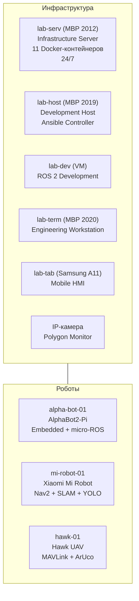

# Lab4Ros — Гетерогенная робототехническая лаборатория

**Версия:** 5.0
**Дата:** Июль 2026
**Статус:** Production Ready — Infrastructure | In Progress — Robots

---

## 🎯 О проекте

Lab4Ros — это **воспроизводимая, гетерогенная робототехническая лаборатория** на базе ROS 2 Jazzy, построенная по принципу Infrastructure as Code. Лаборатория включает серверную инфраструктуру, среду разработки, мобильный терминал, HMI-узел и три роботизированные платформы.

### Ключевые характеристики

- **Инфраструктура:** 92% промышленного стандарта
- **Устройства:** 5 инфраструктурных + 3 робота + IP-камера
- **Репозитории:** 6 активных (+ плановые для роботов)
- **CI/CD:** GitHub Actions + Forgejo Actions
- **Мониторинг:** Grafana + Loki + Telegraf + IP-камера
- **Безопасность:** UFW + Tailscale VPN + Ansible Vault + BorgBackup
- **Горизонт актуальности:** до 2031–2032 года

---

## 🏗️ Архитектура



### 🤖 Роботизированные платформы

| Робот | Вычислитель | ROS 2 | Специализация | Статус |
|-------|:---:|:-----:|---------------|:------:|
| **AlphaBot2-Pi** | RPi 5 2GB | Jazzy (ros-base) | Embedded + micro-ROS + 22 сенсора | 🔴 Сборка |
| **Mi Robot** | RPi 5 8GB + NVMe 1TB | Jazzy (полный) | Nav2 + SLAM + YOLO | ⬚ Закупка |
| **Hawk** | RPi Zero 2 W | Jazzy + MAVROS | MAVLink + видео + ArUco | ⬚ Закупка |

---

## 🛠️ Технологический стек

### Инфраструктура

| Категория | Технологии |
|-----------|------------|
| **IaC** | Ansible (10 ролей), Molecule, Ansible Vault |
| **Контейнеризация** | Docker Engine, Docker Compose (11 контейнеров) |
| **CI/CD** | GitHub Actions, Forgejo Actions, Pre-commit, Renovate |
| **Мониторинг** | Grafana, Loki, Promtail, Telegraf, InfluxDB |
| **Бэкапы** | BorgBackup (ежедневно, 3-2-1) |
| **VPN** | Tailscale (основной), AmneziaWG (резервный) |
| **Конфигурация** | Chezmoi, Syncthing |
| **Безопасность** | UFW, SSH ED25519, Ansible Vault |
| **Сеть** | Wi-Fi 5 GHz, CycloneDDS (ROS Domain 42) |

### Робототехника

| Категория | Технологии |
|-----------|------------|
| **Фреймворк** | ROS 2 Jazzy Jalisco (LTS) |
| **DDS** | CycloneDDS |
| **Средства связи** | MQTT (Mosquitto), MAVLink (Hawk) |
| **Компьютерное зрение** | OpenCV, YOLO (Mi Robot), ArUco (Hawk) |
| **Навигация** | Nav2, SLAM Toolbox |
| **Микроконтроллеры** | micro-ROS, STM32F401, Pico W, ESP32 |
| **Сенсоры** | LiDAR LDS, GPS M9N, IMU, энкодеры, 22 сенсора (AlphaBot2) |
| **Средства разработки** | DevContainer (ARM64 cross-compilation), Foxglove Studio |

---

## 📊 Мониторинг и Observability

- **Grafana:** Дашборды системных метрик, Docker-контейнеров, сетевой активности
- **Loki + Promtail:** Централизованные логи (Docker, системные, аудит)
- **IP-камера:** Снапшоты полигона каждые 10 секунд, хранение 7 дней, внешний доступ через Tailscale
- **Telegraf:** Сбор метрик с CPU, RAM, дисков, Docker

---

## 🔒 Безопасность

| Принцип | Реализация |
|---------|------------|
| Минимальные привилегии | SSH-доступ по матрице 8×8 |
| Defence in depth | UFW → SSH keys → Ansible Vault → BorgBackup |
| Zero trust WAN | Tailscale (основной) + AmneziaWG (резерв) |
| Сегментация сети | Функциональные IP-группы, план VLAN (2028+) |
| Шифрование | WireGuard (Tailscale), ChaCha20 (AmneziaWG), HTTPS |

---

## 📁 Репозитории

| Репозиторий | Содержимое | Статус |
|-------------|------------|:------:|
| `lab-infra` | Ansible IaC, Docker Compose, CI/CD | ✅ |
| `dotfiles` | Конфигурации (Chezmoi) | ✅ |
| `lab-dev-config` | ROS 2 исходный код | ✅ |
| `alpha-bot-ros2` | AlphaBot2-Pi ROS 2 пакеты | ⬚ План |
| `mi-robot-ros2` | Mi Robot ROS 2 пакеты | ⬚ План |
| `hawk-ros2` | Hawk ROS 2 + MAVROS | ⬚ План |

---

## 🚀 Быстрый старт

### Развёртывание инфраструктуры с нуля

```bash
git clone https://github.com/al-sapsan/lab-infra.git
cd lab-infra
bash bootstrap.sh
ansible-playbook site.yml
```

### Применение изменений

```bash
cd ~/lab-infra
git pull origin main
make check
ansible-playbook site.yml --limit lab-serv
```

---

## 📈 Roadmap

### Этап 0: Подготовка (Июль–Август 2026) — 90% завершено

- [x] Infrastructure as Code (Ansible, 10 ролей)
- [x] CI/CD (GitHub Actions + Forgejo Actions)
- [x] Мониторинг (Grafana + Loki + IP-камера)
- [x] Disaster Recovery (BorgBackup)
- [x] IP-сегментация (лаборатория + IoT + гости)
- [ ] Закупка оборудования для роботов

### Этап 1: AlphaBot2-Pi (Август–Сентябрь 2026)

- [ ] Сборка шасси
- [ ] RPi 5 2GB + Ubuntu 24.04 + ROS 2 Jazzy
- [ ] Драйвер моторов (PCA9685) + датчики
- [ ] STM32F401 + micro-ROS
- [ ] Teleop с клавиатуры

### Этап 2: Hawk + Mi Robot (Сентябрь–Ноябрь 2026)

- [ ] Hawk: сборка рамы, прошивка Pixhawk, MAVROS, видеострим
- [ ] Mi Robot: реверс-инжиниринг GD32, RPi 5, Nav2, YOLO

### Этап 3: Интеграция (2027)

- [ ] Распределённый ROS 2 (3 узла DDS)
- [ ] Multi-robot координация
- [ ] Fleet Management (Ansible)

---

## 📝 Автор

- **Инфраструктура и DevOps:** sapsan
- **Робототехника и разработка:** sapsan

---

## 📄 Лицензия

MIT License

---

> **Lab4Ros v5.0** — от инфраструктуры к роботам. Воспроизводимая, безопасная, масштабируемая.
