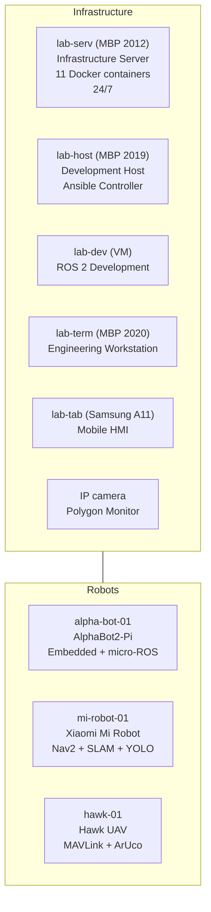

# Lab4Ros — Heterogeneous Robotics Laboratory

**Version:** 5.0  
**Date:** July 2026  
**Status:** Production Ready — Infrastructure | In Progress — Robots  

---

## 🎯 About the Project

Lab4Ros is a **reproducible, heterogeneous robotics laboratory** based on ROS 2 Jazzy, built according to the Infrastructure as Code principle. The laboratory includes server infrastructure, a development environment, a mobile terminal, an HMI node, and three robotic platforms.

### Key Characteristics

- **Infrastructure:** 92% industrial standard compliance  
- **Devices:** 5 infrastructure units + 3 robots + IP camera  
- **Repositories:** 6 active (+ planned for robots)  
- **CI/CD:** GitHub Actions + Forgejo Actions  
- **Monitoring:** Grafana + Loki + Telegraf + IP camera  
- **Security:** UFW + Tailscale VPN + Ansible Vault + BorgBackup  
- **Relevance Horizon:** until 2031–2032  

---

## 🏗️ Architecture



### 🤖 Robotic Platforms

| Robot | Compute Unit | ROS 2 | Specialization | Status |
|-------|:---:|:-----:|---------------|:------:|
| **AlphaBot2-Pi** | RPi 5 2GB | Jazzy (ros-base) | Embedded + micro-ROS + 22 sensors | 🔴 Assembly |
| **Mi Robot** | RPi 5 8GB + NVMe 1TB | Jazzy (full) | Nav2 + SLAM + YOLO | ⬚ Procurement |
| **Hawk** | RPi Zero 2 W | Jazzy + MAVROS | MAVLink + video + ArUco | ⬚ Procurement |

---

## 🛠️ Technology Stack

### Infrastructure

| Category | Technologies |
|-----------|------------|
| **IaC** | Ansible (10 roles), Molecule, Ansible Vault |
| **Containerization** | Docker Engine, Docker Compose (11 containers) |
| **CI/CD** | GitHub Actions, Forgejo Actions, Pre-commit, Renovate |
| **Monitoring** | Grafana, Loki, Promtail, Telegraf, InfluxDB |
| **Backups** | BorgBackup (daily, 3-2-1 rule) |
| **VPN** | Tailscale (primary), AmneziaWG (backup) |
| **Configuration** | Chezmoi, Syncthing |
| **Security** | UFW, SSH ED25519, Ansible Vault |
| **Networking** | Wi‑Fi 5 GHz, CycloneDDS (ROS Domain 42) |

### Robotics

| Category | Technologies |
|-----------|------------|
| **Framework** | ROS 2 Jazzy Jalisco (LTS) |
| **DDS** | CycloneDDS |
| **Communication** | MQTT (Mosquitto), MAVLink (Hawk) |
| **Computer Vision** | OpenCV, YOLO (Mi Robot), ArUco (Hawk) |
| **Navigation** | Nav2, SLAM Toolbox |
| **Microcontrollers** | micro-ROS, STM32F401, Pico W, ESP32 |
| **Sensors** | LiDAR LDS, GPS M9N, IMU, encoders, 22 sensors (AlphaBot2) |
| **Development Tools** | DevContainer (ARM64 cross-compilation), Foxglove Studio |

---

## 📊 Monitoring and Observability

- **Grafana:** Dashboards for system metrics, Docker containers, and network activity  
- **Loki + Promtail:** Centralized logs (Docker, system, audit)  
- **IP Camera:** Polygon snapshots every 10 seconds, 7‑day retention, external access via Tailscale  
- **Telegraf:** Metrics collection for CPU, RAM, disks, Docker  

---

## 🔒 Security

| Principle | Implementation |
|---------|---------------|
| Least Privilege | SSH access via 8×8 matrix |
| Defence in Depth | UFW → SSH keys → Ansible Vault → BorgBackup |
| Zero Trust WAN | Tailscale (primary) + AmneziaWG (backup) |
| Network Segmentation | Functional IP groups, VLAN plan (2028+) |
| Encryption | WireGuard (Tailscale), ChaCha20 (AmneziaWG), HTTPS |

---

## 📁 Repositories

| Repository | Contents | Status |
|-------------|------------|:------:|
| `lab-infra` | Ansible IaC, Docker Compose, CI/CD | ✅ |
| `dotfiles` | Configurations (Chezmoi) | ✅ |
| `lab-dev-config` | ROS 2 source code | ✅ |
| `alpha-bot-ros2` | AlphaBot2-Pi ROS 2 packages | ⬚ Planned |
| `mi-robot-ros2` | Mi Robot ROS 2 packages | ⬚ Planned |
| `hawk-ros2` | Hawk ROS 2 + MAVROS | ⬚ Planned |

---

## 🚀 Quick Start

### Deploy Infrastructure from Scratch

```bash
git clone https://github.com/al-sapsan/lab-infra.git
cd lab-infra
bash bootstrap.sh
ansible-playbook site.yml
```

### Apply Changes

```bash
cd ~/lab-infra
git pull origin main
make check
ansible-playbook site.yml --limit lab-serv
```

---

## 📈 Roadmap

### Phase 0: Preparation (July–August 2026) — 90% Complete

- [x] Infrastructure as Code (Ansible, 10 roles)  
- [x] CI/CD (GitHub Actions + Forgejo Actions)  
- [x] Monitoring (Grafana + Loki + IP camera)  
- [x] Disaster Recovery (BorgBackup)  
- [x] IP segmentation (lab + IoT + guests)  
- [ ] Robot hardware procurement  

### Phase 1: AlphaBot2‑Pi (August–September 2026)

- [ ] Chassis assembly  
- [ ] RPi 5 2GB + Ubuntu 24.04 + ROS 2 Jazzy  
- [ ] Motor driver (PCA9685) + sensors  
- [ ] STM32F401 + micro-ROS  
- [ ] Keyboard teleoperation  

### Phase 2: Hawk + Mi Robot (September–November 2026)

- [ ] Hawk: frame assembly, Pixhawk firmware, MAVROS, video streaming  
- [ ] Mi Robot: GD32 reverse engineering, RPi 5, Nav2, YOLO  

### Phase 3: Integration (2027)

- [ ] Distributed ROS 2 (3 DDS nodes)  
- [ ] Multi-robot coordination  
- [ ] Fleet Management (Ansible)  

---

## 📝 Author

- **Infrastructure and DevOps:** sapsan  
- **Robotics and Development:** sapsan  

---

## 📄 License

MIT License  

---

> **Lab4Ros v5.0** — from infrastructure to robots. Reproducible, secure, scalable.
